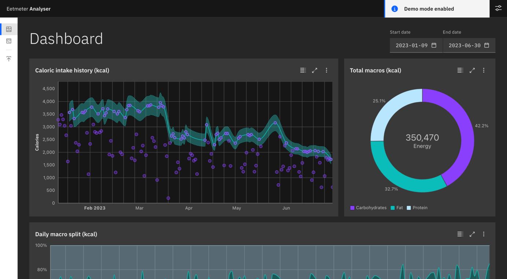

# Eetmeter analyser 🍎
A tool to gather insights from Eetmeter data not available through the official app and website built in SvelteKit.
Your data does not leave your browser, the tool relies on IndexedDB for data storage and analysis. Though this also
means I don't keep a backup for you ;). You can try it out at [https://eetmeter.simonvreman.nl/](https://eetmeter.simonvreman.nl/).

## Features 👉
- Import XML exports from Eetmeter
- Explore the imported data
- View data visualisations for different time periods
- Demo mode to try without importing your own data

## Tech stack 🛠️
- SvelteKit
- TailwindCSS
- Carbon Components
- D3.js
- Dexie.js

## Running the project 💨
- Install dependencies with `npm install`
- Run the project with `npm run dev`
- Or build using `npm run build`

## License 📄
[MIT](license)